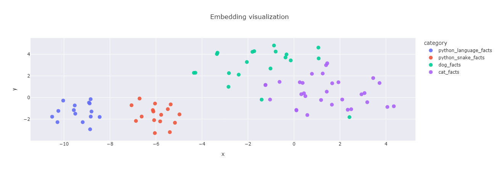
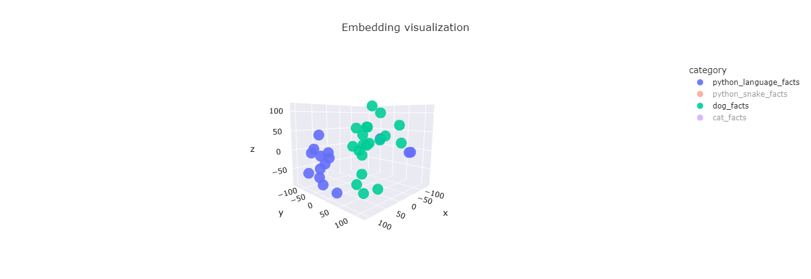

# how-to-knowledge-base
Enhancing LLM Outputs with RAG: How to build a Knowledge Base - Visualized

This notebook aims to illustrate how to build a knowledge base using RAG.
In order to visualize why and how this works, we generate text embeddings, reduce the embeddingspace to two dimensions, and plot the results.
The results will display the semantic structure and similarities of the embedded texts and may look like this:




You are not limited to just two dimensions, you can reduce the dimensions as you like and plot the results.
In this example you can see the dimensions being reduced to three.


# Setup

It is a best practice to create a virtual environment for your project.
you can do that with the following command:

```bash
python3 -m venv venv
```

Then activate the virtual environment:

```bash
source venv/bin/activate
# or Windows:
venv\Scripts\activate
```

## Requirements

If you don't have jupyter installed, you can install it with the following command:

```bash
pip install jupyter
```

Install the requirements with the following command:
```bash
pip install -r requirements.txt
```

Rename the `.env.example` file to `.env` and set your OpenAI API key as an environment variable:
```bash
OPENAI_API_KEY=<your_api_key>
```

## Using FOSS Models

You may also use different AI models for embedding generation and text completion.
In case you want to use different models, I recommend to change the open_ai_connector.py file to use different models.
There ares some good and easy to use embedding models, that you can run locally for free.
I recommend checking out huggingface (https://huggingface.co) and the transformers library or the BERT models (https://www.sbert.net/docs/sentence_transformer/pretrained_models.html) for that. 
